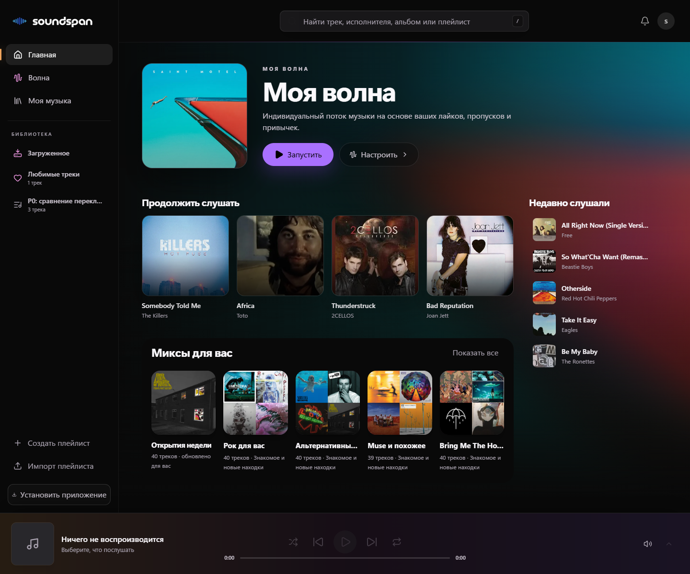
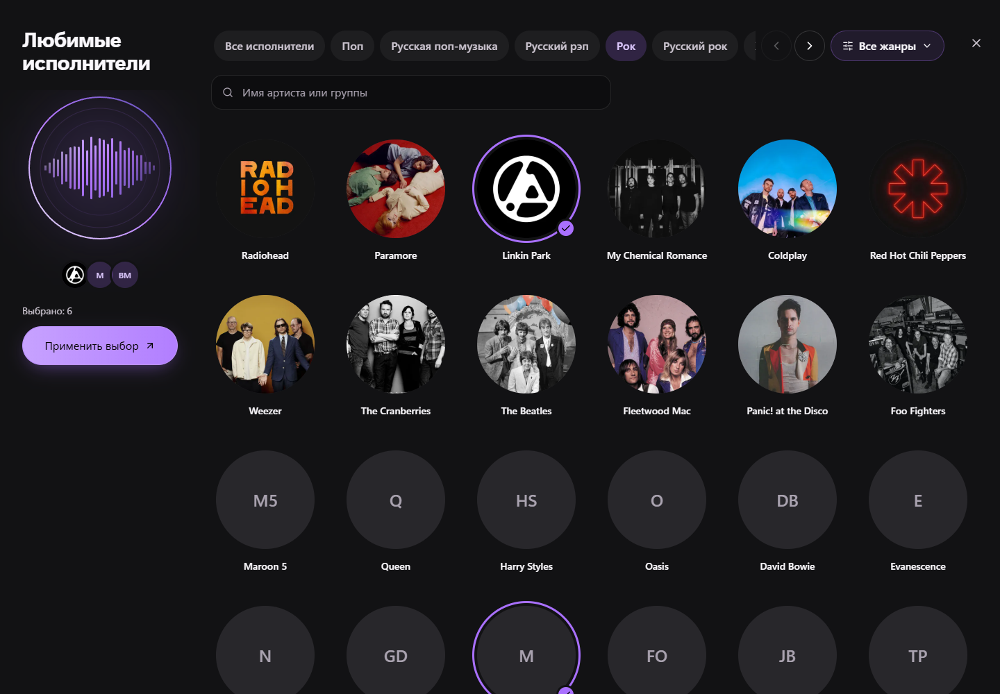
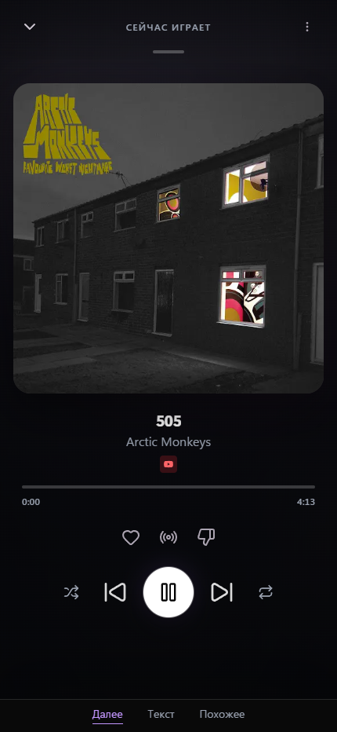
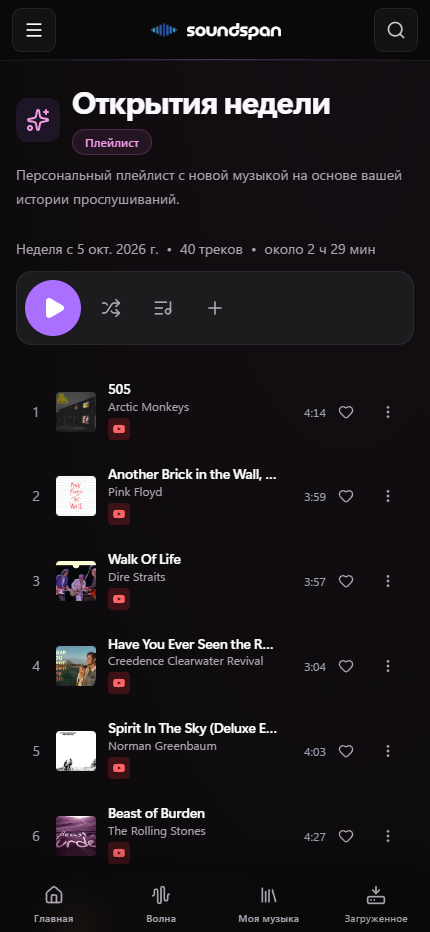

# Soundspan

[Русский](README.md) · **English**

[](https://github.com/Tipson/soundspan/actions/workflows/core-user-journeys.yml)
[](https://github.com/Tipson/soundspan/actions/workflows/quality-visibility.yml)
[](LICENSE)

**A personal music platform: your own Wave, long mixes, weekly discoveries, and offline listening.**

Soundspan brings online sources and your own music library together in one web application. Choose favorite artists, listen, and rate tracks: recommendations draw on your preferences and listening history. Host the platform on your own server and install the application on your phone as a PWA.

[Web Application](https://music.agentik007.ru) · [Deployment](docs/DEPLOYMENT.md) · [Documentation](docs/README.md) · [Report a Problem](https://github.com/Tipson/soundspan/issues)

<a href="assets/screenshots/soundspan/home-desktop.png"></a>

Screenshots show this repository's interface with Russian UI labels.

## Music shaped by your taste

| Feature                                | How it works                                                                                                                                                       |
| -------------------------------------- | ------------------------------------------------------------------------------------------------------------------------------------------------------------------ |
| **My Wave**                            | A personal stream informed by preferences, listening history, likes, and dislikes. Selection considers recent repeats and artist diversity.                        |
| **Daily Mixes**                        | Up to six mixes organized around musical styles. Generated mixes contain 20–40 tracks; the number of mixes depends on available music and your profile.            |
| **Discover Weekly**                    | Music that is new to you, targeting up to 40 tracks. The selection stays stable for the week; a new week begins on Monday UTC and is generated on the first visit. |
| **Morning, afternoon, evening, night** | Mixes take your local time and listening habits during that period into account.                                                                                   |
| **Track and artist radio**             | Continue with related music while keeping the original station direction as the queue grows.                                                                       |
| **Taste setup**                        | Full-screen artist selection, genres, search, and catalog loading as you scroll. There is no limit on the number of selected artists or genres.                    |
| **Multiple sources**                   | YouTube Music, configured VK/Yandex sources, and your local library. Available sources are selected automatically with recording-match checks.                     |
| **Offline listening**                  | Tracks downloaded to the device remain available without a network, including startup of the cached application.                                                   |

### Choose your favorite artists

Update your choices in settings. They help form initial recommendations and are stored separately from likes.

<a href="assets/screenshots/soundspan/taste-desktop.png"></a>

## On desktop and mobile

Soundspan runs in the browser and can be installed as a PWA. Mobile users have compact and full-screen players, a queue, track feedback, and system media controls. Download music while online to listen later without a connection.

<a href="assets/screenshots/soundspan/player-mobile.png"></a>
<a href="assets/screenshots/soundspan/weekly-mobile.png"></a>

## Your music and collection

- A local library with metadata, artwork, and search.
- Separate playlists, favorite tracks, and listening history for each user.
- Spotify and Deezer playlist imports with recording matching against available sources.
- Shared listening through Listen Together.
- An OpenSubsonic-compatible API for third-party clients.

Optional integrations include Last.fm/ListenBrainz, Lidarr, Soulseek, and Audiobookshelf. Podcasts and audiobooks are also supported; see the [integration guide](docs/INTEGRATIONS.md) for setup.

## Host it yourself

This repository contains our version of Soundspan. Build its images from source to deploy it. Images under `ghcr.io/soundspan/*` belong to the upstream project and do not include this repository's changes.

You need Git, Docker Engine or Docker Desktop, and Docker Compose v2 with `additional_contexts` support.

```bash
git clone https://github.com/Tipson/soundspan.git
cd soundspan
cp .env.example .env
```

Edit `.env` before starting:

| Variable                  | Value                                                                                                                              |
| ------------------------- | ---------------------------------------------------------------------------------------------------------------------------------- |
| `MUSIC_PATH`              | Absolute path to an existing music directory on the server.                                                                        |
| `POSTGRES_PASSWORD`       | A separate random database password.                                                                                               |
| `SESSION_SECRET`          | A random secret at least 32 characters long.                                                                                       |
| `SETTINGS_ENCRYPTION_KEY` | A separate random settings-encryption key.                                                                                         |
| `INTERNAL_API_SECRET`     | A separate random service-to-service secret, at least 32 characters long.                                                          |
| `DATABASE_URL`            | Leave empty: containers use the PostgreSQL address from Compose. The example's `localhost:5433` value is for host-run development. |
| `BACKEND_PROCESS_ROLE`    | `api`: a separate worker handles background tasks.                                                                                 |

Run `openssl rand -base64 32` separately for each password or secret. Keep these values for subsequent starts and recovery.

Build and start the core application and YouTube Music sidecar from source:

```bash
docker compose -f docker-compose.yml --profile worker up -d --build \
  postgres redis backend backend-worker frontend ytmusic-streamer
```

Open `http://localhost:3030/onboarding` and create the first administrator before exposing the server publicly. Configure external sources and the required integration keys. Use HTTPS for public access and PWA installation.

Audio analysis and DCLAP are configured separately; the command above does not start them. Deployment variants, prebuilt images for your own fork, source configuration, and updates are covered in the [Deployment Guide](docs/DEPLOYMENT.md), [Integration Guide](docs/INTEGRATIONS.md), and [environment reference](docs/ENVIRONMENT_VARIABLES.md).

## What to expect

- Online catalog availability depends on external sources and their configuration. Soundspan does not host its own copy of the Spotify or Yandex catalog.
- Personalized mixes need suitable available music and taste signals. A new account may receive fewer mixes; feedback changes may reduce a saved weekly selection.
- Online Discover Weekly is used when no prepared weekly playlist from the local library exists. A configured local discovery playlist takes precedence.
- Offline listening uses music previously saved on that specific device. Search and new recommendations need a network connection.
- Background playback, system controls, and PWA storage depend on the browser and operating system.
- Cross-source matching uses verified recording information; universal duplicate protection across every version of a song remains a development goal.

## Further development

- Queue and playback-position sync between devices with one active playback device.
- More accurate recording-version matching and cross-catalog repeat protection.
- Improving Wave and mix quality using real listening patterns and feedback.
- Android and iPhone acceptance checks for background and offline listening.

## Documentation and development

| Topic                      | Guide                                                                     |
| -------------------------- | ------------------------------------------------------------------------- |
| Using the application      | [Usage Guide](docs/USAGE_GUIDE.md)                                        |
| Installation and updates   | [Deployment](docs/DEPLOYMENT.md)                                          |
| Configuration and security | [Configuration and Security](docs/CONFIGURATION_AND_SECURITY.md)          |
| Sources and integrations   | [Integrations](docs/INTEGRATIONS.md)                                      |
| Platform structure         | [Architecture](docs/ARCHITECTURE.md)                                      |
| Playback diagnostics       | [Playback Diagnostics](docs/observability/playback-diagnostic-summary.md) |
| Third-party music clients  | [Subsonic Clients](docs/SUBSONIC_CLIENTS.md)                              |
| Testing                    | [Testing](docs/TESTING.md)                                                |

Local development requires Node.js 24+. Install packages with `npm run setup:ci`. Python versions depend on the service and are specified in its Dockerfile; Docker deployment does not require Python on the host. The complete development and verification workflow is documented in [CONTRIBUTING.md](CONTRIBUTING.md) and [AGENTS.md](AGENTS.md). The [documentation index](docs/README.md) lists all guides.

Report problems in [Issues](https://github.com/Tipson/soundspan/issues), including reproduction steps, browser/device details, and relevant logs with passwords and tokens removed.

## License and acknowledgments

The project is distributed under [GNU GPL v3](LICENSE). Use content you can legally access; external services' terms still apply.

This version builds on [soundspan/soundspan](https://github.com/soundspan/soundspan), which grew from [Chevron7Locked/kima-hub](https://github.com/Chevron7Locked/kima-hub). Thank you to the original projects' authors and contributors, and to the developers of MusicBrainz, Last.fm, ytmusicapi, yt-dlp, and the other components used here. External service names and trademarks belong to their respective owners.
