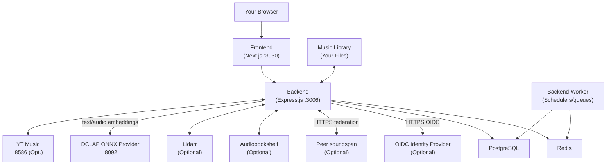

# soundspan™

[](https://github.com/Tipson/soundspan/actions/workflows/core-user-journeys.yml)
[](https://ghcr.io/soundspan/soundspan)
[](https://github.com/soundspan/soundspan/releases)
[](https://www.gnu.org/licenses/gpl-3.0)

A self-hosted music platform with personalized radio, daily mixes, multi-source streaming, and offline PWA playback.

Choose favorite artists, discover music through your personal Wave, and play long mixes shaped by your listening history and feedback. Use YouTube Music and configured VK/Yandex sources alongside your own library, with automatic source selection and exact recording identities. Save tracks to the installed PWA for offline listening.

This repository develops a music-focused variant of soundspan. It also retains optional podcast, audiobook, playlist-import, and OpenSubsonic integrations. The hosted instance is available at [music.agentik007.ru](https://music.agentik007.ru).

> Credits: this variant builds on [`soundspan/soundspan`](https://github.com/soundspan/soundspan), which began from [`Chevron7Locked/kima-hub`](https://github.com/Chevron7Locked/kima-hub). Thank you to the original projects and their contributors.

The screenshots below show the upstream interface. This variant's taste setup, mixes, and mobile controls have their own layouts.

<a href="assets/screenshots/web-home.png"></a>

---

## Highlights

- Personal Wave with current feedback, recent-listening protection, and artist diversity
- Up to six daily style mixes with 20–40 tracks when enough personal candidates are available, plus mixes for the listener's local time of day
- Stable account-scoped Discover Weekly compositions when discovery is enabled
- YouTube Music streaming and optional server-configured VK/Yandex recordings with private likes, dislikes, listening history, and automatic source selection
- Track and artist radio that retains its original station while loading more songs
- Full-screen artist selection with genre scrolling and incremental catalog loading
- Offline PWA downloads, cached startup, and playback of downloaded music without a connection
- Mobile player navigation, focused track actions, and previous/next system media controls for music
- Playback recovery diagnostics and automated browser checks for the main listening journeys
- Local FLAC, MP3, AAC/M4A, OGG/Opus, WAV, WMA, APE, and WavPack library with automatic MusicBrainz/Last.fm enrichment
- DCLAP ONNX-powered vibe matching and mood mixer presets
- Podcast search/subscribe via RSS with resume, played-state tracking, and mobile skip controls
- Audiobookshelf integration with unified browsing/playback and progress sync
- Programmatic playlist generation, artist-diversity balancing, and library radio stations
- Synced lyrics, source/quality badges, and browser/PWA/overlay player flows
- Per-user Last.fm and ListenBrainz scrobbling with now-playing updates, including plays from Subsonic clients
- Unified song search that ranks owned and discoverable songs together, with shareable per-song links
- Multiple users with isolated playlists, likes, history, and settings, plus admin roles, optional 2FA, and Listen Together group sessions
- Federated library sharing between trusted soundspan instances, opt-in and disabled by default
- OIDC/SSO login with explicit account linking and revocable app passwords for OpenSubsonic clients
- Deezer previews plus Spotify/Deezer playlist import flows and provider track mapping APIs
- OpenSubsonic-compatible `/rest` API surface for third-party client access

<a href="assets/screenshots/web-library.png"></a>

<a href="assets/screenshots/web-explore.png"></a>

<a href="assets/screenshots/web-player-lyrics.png"></a>

For the full feature list and release notes, see [`CHANGELOG.md`](CHANGELOG.md).

Optional anonymous YouTube challenge recovery and its operational limits are
documented in [YouTube PO recovery](docs/YOUTUBE_PO_RECOVERY.md).

---

## Quick Start

The prebuilt images linked here belong to the upstream distribution. Build from this repository to deploy this variant's code; deployment modes and source-build configuration are documented in [`docs/DEPLOYMENT.md`](docs/DEPLOYMENT.md). VK/Yandex playback requires server-enabled sources and their configured access; source availability depends on the provider.

### Upstream one-command install

```bash
docker run -d \
  --name soundspan \
  -p 3030:3030 \
  -v /path/to/your/music:/music \
  -v soundspan_data:/data \
  ghcr.io/soundspan/soundspan:latest
```

Open `http://localhost:3030` and create your account.

Authenticated clients can read, complete, replace, or skip the current
account's initial recommendation profile through `GET`, `POST`, and `PUT`
`/api/taste-profile`. The endpoint stores bounded provider metadata only; it
does not download audio or turn the selected seeds into synthetic likes.

The AIO image includes the MusicCNN analyzer and a CPU-first DCLAP ONNX
provider. The backend sends text and audio vibe embedding work to the provider
over container loopback. Its vendored artifacts total a few hundred MB.

### Upstream GPU mode for MusiCNN analysis

```bash
docker run -d \
  --name soundspan \
  --gpus all \
  -p 3030:3030 \
  -v /path/to/your/music:/music \
  -v soundspan_data:/data \
  ghcr.io/soundspan/soundspan:latest
```

For deployment variants, release channels, compose files, and updates, see [`docs/DEPLOYMENT.md`](docs/DEPLOYMENT.md).

---

## Documentation

- Documentation index (all guides): [`docs/README.md`](docs/README.md)
- Usage guide (navigation, playback, admin): [`docs/USAGE_GUIDE.md`](docs/USAGE_GUIDE.md)
- Deployment modes and updates: [`docs/DEPLOYMENT.md`](docs/DEPLOYMENT.md)
- Configuration and security: [`docs/CONFIGURATION_AND_SECURITY.md`](docs/CONFIGURATION_AND_SECURITY.md)
- Playback diagnostic report: [`docs/observability/playback-diagnostic-summary.md`](docs/observability/playback-diagnostic-summary.md)
- OIDC and SSO setup: [`docs/OIDC_SSO.md`](docs/OIDC_SSO.md)
- Environment variables reference: [`docs/ENVIRONMENT_VARIABLES.md`](docs/ENVIRONMENT_VARIABLES.md)
- Integration setup (Lidarr, Soulseek, YouTube Music, Last.fm, OpenSubsonic): [`docs/INTEGRATIONS.md`](docs/INTEGRATIONS.md)
- Vibe analysis and optional GPU acceleration: [`docs/ADVANCED_ANALYSIS_AND_GPU.md`](docs/ADVANCED_ANALYSIS_AND_GPU.md)
- Kubernetes deployment: [`docs/KUBERNETES.md`](docs/KUBERNETES.md)
- Reverse proxy and tunnel routing: [`docs/REVERSE_PROXY_AND_TUNNELS.md`](docs/REVERSE_PROXY_AND_TUNNELS.md)
- OpenSubsonic compatibility contract: [`docs/OPENSUBSONIC_COMPATIBILITY.md`](docs/OPENSUBSONIC_COMPATIBILITY.md)
- Subsonic client matrix and mobile guide: [`docs/SUBSONIC_CLIENTS.md`](docs/SUBSONIC_CLIENTS.md)
- Brand usage policy: [`docs/BRAND_POLICY.md`](docs/BRAND_POLICY.md)

---

## Integrations at a Glance

soundspan supports optional integrations for discovery, downloads, and client compatibility:

- Lidarr
- Audiobookshelf
- Soulseek
- YouTube Music
- Server-configured VK and Yandex Music sources
- Last.fm and ListenBrainz scrobbling
- AcoustID track identification
- OpenSubsonic-compatible `/rest` API

Full setup guides are documented in [`docs/INTEGRATIONS.md`](docs/INTEGRATIONS.md).

### Integration API quick reference

All integration endpoints below require soundspan auth (session or API key where supported) and admin-enabled integrations.

| Area                                                    | Endpoints                                                                                                                                                              |
| ------------------------------------------------------- | ---------------------------------------------------------------------------------------------------------------------------------------------------------------------- |
| YouTube Music browse (OAuth-free)                       | `GET /api/browse/ytmusic/charts`, `GET /api/browse/ytmusic/categories`, `GET /api/browse/ytmusic/playlist/:id`                                                         |
| YouTube Music public stream (OAuth-free)                | `GET /api/ytmusic/stream-info-public/:videoId`, `GET /api/ytmusic/stream-public/:videoId`                                                                              |
| YouTube Music search/match (OAuth-free sidecar clients) | `POST /api/ytmusic/search`, `POST /api/ytmusic/match`, `POST /api/ytmusic/match-batch`                                                                                 |
| Mapping/import APIs                                     | `POST /api/browse/playlists/parse`, `GET /api/track-mappings/album/:albumId`, `POST /api/track-mappings/batch`, `POST /api/import/preview`, `POST /api/import/execute` |

---

## Web & PWA

soundspan is browser-first. Use it from your desktop or mobile browser, or install it through your browser's PWA flow for app-like behavior, background playback, media controls, and faster repeat loads.

Download music in the PWA before going offline. The cached application shell and account-scoped downloads support startup and playback without a connection; online catalog browsing and new recommendations still require network access. Offline storage and background behavior depend on the browser and device.

### On mobile

soundspan's mobile story is deliberate: there is no native app, and none is planned. Install the PWA for the full soundspan experience, and use a Subsonic client when you want native ergonomics — offline caching, Android Auto / CarPlay, and platform audio integration through the OpenSubsonic-compatible `/rest` API. Both are first-class.

A per-client compatibility matrix (Symfonium, Tempo, DSub2000, Ultrasonic, play:Sub), connection quickstart, and the extension roadmap live in [`docs/SUBSONIC_CLIENTS.md`](docs/SUBSONIC_CLIENTS.md). The authoritative protocol contract is [`docs/OPENSUBSONIC_COMPATIBILITY.md`](docs/OPENSUBSONIC_COMPATIBILITY.md).

### Android TV

soundspan includes a TV-optimized browser interface with D-pad/remote navigation and a persistent now-playing bar.

---

## Architecture

soundspan consists of several cooperating services:



| Component           | Purpose                                                                       | Default Port         |
| ------------------- | ----------------------------------------------------------------------------- | -------------------- |
| Frontend            | Web interface (Next.js)                                                       | 3030                 |
| Backend             | API server (Express.js)                                                       | 3006                 |
| Backend Worker      | Background queues, processors, and scheduled jobs                             | 3010 health endpoint |
| PostgreSQL          | Primary database (with pgvector and pg_trgm)                                  | 5432                 |
| Redis               | Cache and queue backend                                                       | 6379                 |
| YT Music Streamer   | YouTube Music streaming proxy                                                 | 8586                 |
| Audio Analyzer      | MusiCNN analysis and local Chromaprint fingerprints; optional AcoustID lookup | —                    |
| DCLAP Vibe Provider | ONNX text/audio embedding service                                             | 8092 (internal)      |

---

## Roadmap

- Cross-device playback handoff with one active playback device
- Broader cross-source duplicate protection through verified recording-version identity
- Continued device acceptance and recommendation-quality evaluation

---

## Disclaimer

soundspan is a self-hosted music management tool intended for content you own or can legally access.

For optional third-party integrations (YouTube Music and Soulseek):

- You are responsible for compliance with applicable terms and laws
- soundspan is not affiliated with Google, YouTube, or Soulseek
- Streaming/downloading features require your own valid subscriptions where applicable

soundspan is provided "as is" without warranty.

Trademark disclaimer: soundspan is an open-source project. All product names, logos, and brands are property of their respective owners.

---

## License

soundspan is released under the [GNU General Public License v3.0](LICENSE).

---

## Acknowledgments

- [Last.fm](https://www.last.fm/) - artist recommendations and metadata
- [MusicBrainz](https://musicbrainz.org/) - music metadata
- [iTunes Search API](https://developer.apple.com/library/archive/documentation/AudioVideo/Conceptual/iTuneSearchAPI/) - podcast discovery
- [Deezer](https://developers.deezer.com/) - preview and browse sources
- [Fanart.tv](https://fanart.tv/) - artist imagery
- [Lidarr](https://lidarr.audio/) - music collection management
- [Audiobookshelf](https://www.audiobookshelf.org/) - audiobook/podcast server
- [ytmusicapi](https://github.com/sigma67/ytmusicapi) - YouTube Music API wrapper
- [yt-dlp](https://github.com/yt-dlp/yt-dlp) - stream extraction

---

## Support

1. Check existing [Issues](https://github.com/Tipson/soundspan/issues)
2. Open a new issue with setup details and reproduction steps
3. Include relevant logs from `docker compose logs`
